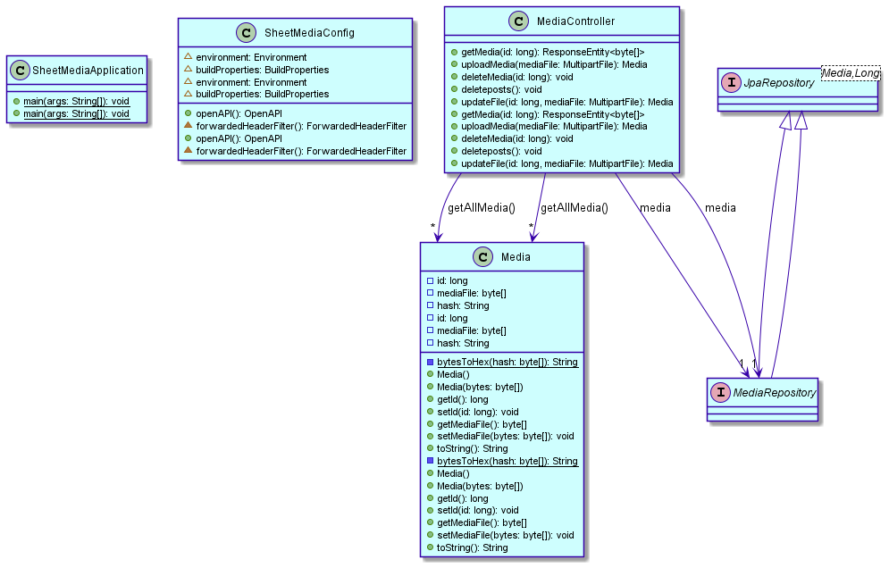

# Sheet

Sheet es una red social que permite a sus usuarios compartir sus publicaciones y unirse a comunidades.
Se podrá iniciar sesión con tu cuenta, seguir a usuarios que se unan, ver sus publicaciones y comentar en ellas.

## Instalación

Sheet puede instalarse mediante dos métodos: o automatizado mediante Docker Compose, o manual.

### Docker Compose

En un entorno con Git y Docker Compose instalados, basta con asegurarse de que los puertos 80 y 443 estén libres
y ejecutar lo siguiente:

```sh
git clone --recurse-submodules https://github.com/grandDAD2022/sheet
cd sheet
docker-compose up
```

### Manual

Para inicializar un servidor Sheet manualmente, se han de realizar los siguientes pasos:

- Instalar las siguientes dependencias en cada entorno Linux usado:
    - Java 17 LTS o superior
    - MySQL o MariaDB
    - Maven y Git (solo para compilación así como despliegue directo de repositorio)

- Obtener el código fuente, sea o en entorno de desarrollo o en producción: `git clone --recurse-submodules https://github.com/grandDAD2022/sheet`

- Inicializar la base de datos para la aplicación web en el entorno Linux correspondiente:

```sql
CREATE DATABASE sheet;
CREATE USER 'sheet'@'localhost' IDENTIFIED BY 'sheet';
GRANT ALL ON sheet.* TO 'sheet'@'localhost';
FLUSH PRIVILEGES;
```

- Inicializar la base de datos para el object storage en el entorno Linux correspondiente:

```sql
CREATE DATABASE sheet_media;
CREATE USER 'sheet_media'@'localhost' IDENTIFIED BY 'sheet_media';
GRANT ALL ON sheet_media.* TO 'sheet_media'@'localhost';
FLUSH PRIVILEGES;
```

- Desplegar los servicios web uno a uno
    - Para despliegue estable, generando JARs
      - `mvn package` (retorna una ruta con el JAR a desplegar)
      - `java -jar <archivo .jar>` para ejecutar el servicio web
    - Para despliegue directo, mediante Spring Boot
      - `mvn spring-boot:run` para ejecutar directamente el servicio web

- Adicionalmente, se recomienda:
    - Crear unidades Systemd, servicios OpenRC o equivalentes para mantener la ejecución automáticamente
    - Usar un firewall para bloquear todos los puertos salvo el que expone la aplicación web

## Funcionalidad
- Pública
    - Acceso a perfiles públicos
    - Registro de cuenta nueva
- Privada
    - Administrar perfil
    - Seguir cuentas
    - Ver publicaciones
    - Crear publicaciones
    - Comentar
    - Recibir notificaciones

## Entidades
- Usuarios
- Publicaciones
- Notificaciones
- Comunidades

## Diagrama de clases UML de sheet ui


## Diagrama de clases UML de sheet media



## Modelo Entidad/Relación


- 1:N
    - Un usuario puede compartir varias publicaciones o ninguna.
    - Las publicaciones solo pueden ser creadas por un usuario.
    - Un usuario puede administrar (crear, modificar y eliminar) varias comunidades.
    - Una comunidad solo puede ser administrada por un usuario.

- N:N
    - Los usuarios tienen la opción de comentar en las publicaciones, y las publicaciones podrán ser comentadas por varios usuarios (Siempre se tendrá un comentario que contendra la fecha y el usuario de la publicación, y de forma opcional una descripción).
    - Un usuario puede estar o tener varias comunidades.
    - Las comunidades pueden tener varios usuarios (mínimo 1).
    - Los usuarios podrán seguirse entre ellos, por lo que, una persona puede seguir a varios perfiles, y estos, podrían seguirle a él.
    - Las comunidades pueden contener varias publicaciones, al igual que, una publicación puede estar en distintas comunidades.
    - Los usuario recibiran varias publicaciones, además, existirán notificaciones del sistema que serán recibidas por todos los usuarios.

## Servicios web
- [Aplicación web](https://github.com/grandDAD2022/sheet-ui)

## Servicios internos
- [Object storage multimedia](https://github.com/grandDAD2022/sheet-media)
- Autenticación
- Notificaciones
- Envío de correo
- Escalado de imágenes
- Compresión de vídeo

## Páginas

### Mural de publicaciones


Esta es la página con la que el usuario será bienvenido cada vez que se conecte.
Muestra sus últimas publicaciones así como las de de las cuentas a las que sigue.
Esta página es privada y solo está disponible con una cookie de sesión.

### Perfil de usuario


Para que cualquiera pueda descubrir y examinar las publicaciones de un usuario,
sus perfiles están disponibles públicamente sin necesidad de iniciar sesión.

### Inicio de sesión


La primera vez que se abre Sheet en una sesión web, aparecerá este menú de inicio de sesión.
Permite tanto insertar credenciales para una cuenta existente, como solicitar registrar una nueva.

### Formulario de registro


Si no se dispone de cuenta de usuario, basta con rellenar los datos del formulario de registro
para ponerse en marcha.
